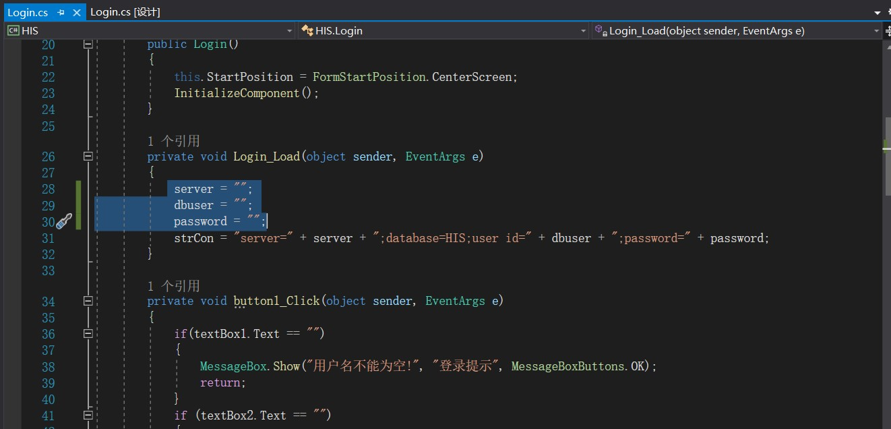
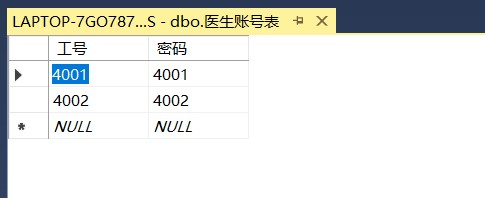

# WinForm医院信息系统

## 1、 简介

​		此项目实现了医院信息系统的两大子系统：挂号系统和医生工作站的部分功能主要功能模块包括：挂号管理、病历书写、处方开具及打印、检验申请单开具及打印、查询统计等

## 2、项目部署

1、将数据库HIS.bak还原到SQL Server（2018及以上版本）

2、使用Visual Studio（2019及以上版本）打开HIS.sln

3、修改Login.cs代码：server = SQL Server所在主机IP，dbuser = 数据库登录名，password = 密码

## 3、运行

​		本项目分为两个子模块：挂号系统 + 医生工作站，挂号系统使用挂号员账号密码登录，医生工作站使用医生账号密码登录，账号密码可从以下数据库表查看，具体运行参考演示视频

## 4、总结

​		由于时间及能力有限，本项目中许多功能并未实现，已实现功能也存在诸多不足，仅供参考
